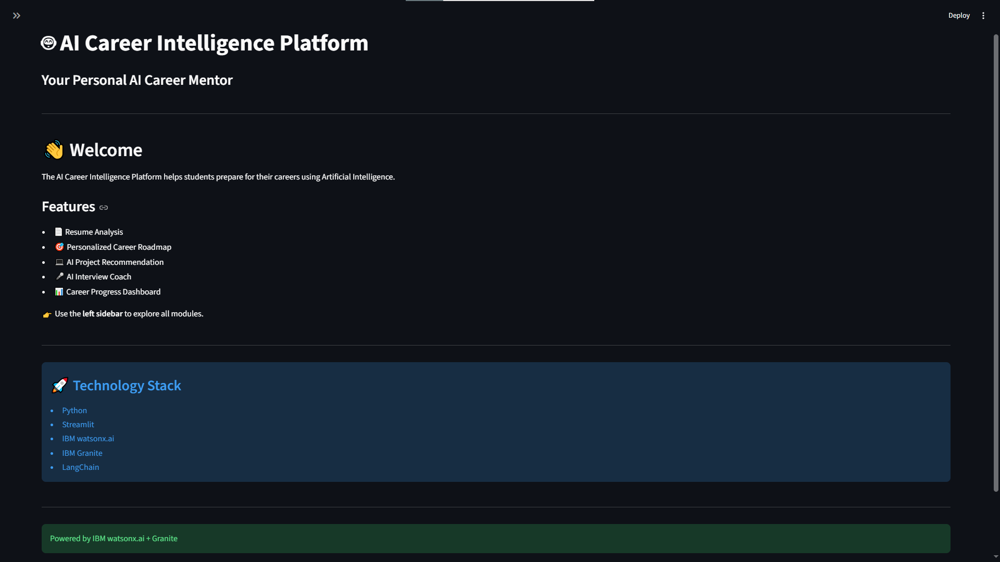
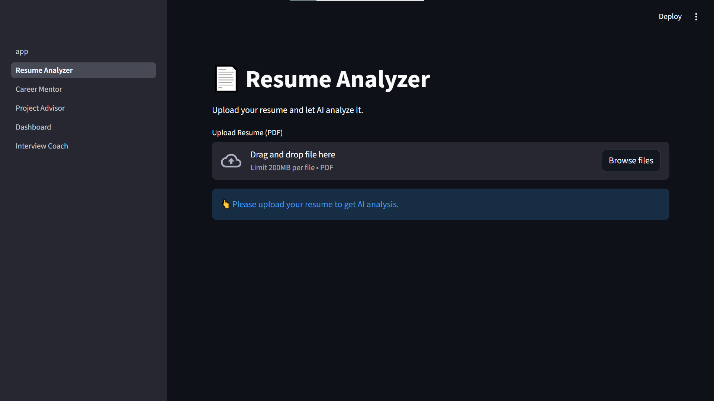
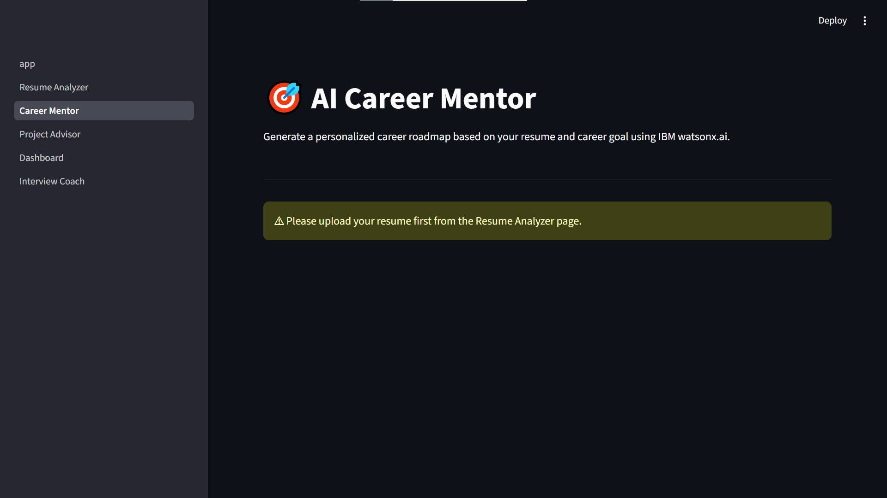
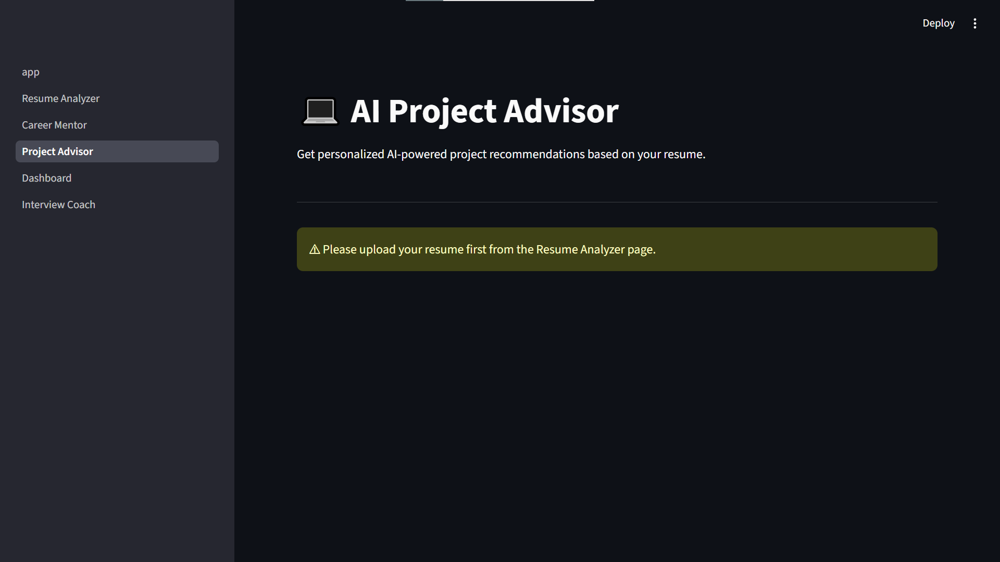
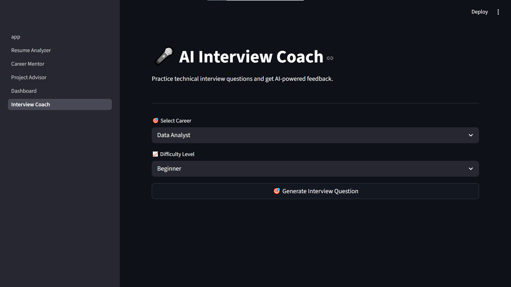
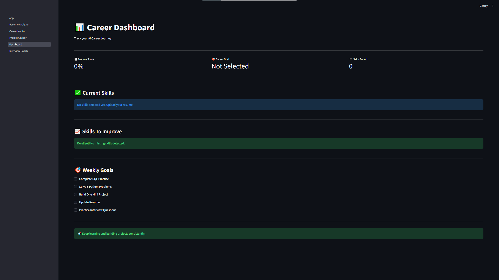

# 🚀 AI Career Intelligence Platform

An AI-powered Career Guidance Platform built using **Streamlit** and **IBM watsonx.ai** that helps users analyze their resume, receive personalized career guidance, get project recommendations, and practice technical interviews.

---

## 📌 Project Overview

The AI Career Intelligence Platform assists students and job seekers by providing intelligent career support through AI.

Users can:

- 📄 Analyze their resume
- 🤖 Get AI-powered resume feedback
- 🎯 Receive a personalized career roadmap
- 💻 Get AI-recommended portfolio projects
- 🎤 Practice technical interview questions
- 📊 Track their learning progress using a dashboard

The application leverages **IBM watsonx.ai** to generate personalized recommendations and feedback.

---

# ✨ Features

### 📄 Resume Analyzer
- Upload PDF Resume
- Extract resume text
- Detect technical skills
- Identify education and experience
- Calculate Resume Score
- AI-powered ATS Resume Feedback

---

### 🎯 AI Career Mentor
- Select career goal
- Personalized learning roadmap
- Required skills
- Skill gap analysis
- Certification recommendations
- 30-Day learning plan
- Interview preparation tips

---

### 💻 AI Project Advisor
- Personalized project recommendations
- Beginner to Advanced projects
- Required technologies
- Expected learning outcomes

---

### 🎤 AI Interview Coach
- Technical interview questions
- AI evaluation of answers
- Technical feedback
- Communication feedback
- Improvement suggestions

---

### 📊 Dashboard
- Resume Score
- Skills Detected
- Career Goal
- Weekly Goals
- Learning Progress

---

# 🛠️ Technology Stack

- Python
- Streamlit
- IBM watsonx.ai
- IBM Granite / LLM
- PDFPlumber
- Pandas
- NumPy
- Scikit-learn
- LangChain
- Python-dotenv

---

# 🤖 IBM watsonx.ai Integration

IBM watsonx.ai is used for:

- AI Resume Feedback
- Career Roadmap Generation
- Project Recommendations
- Interview Evaluation

The platform communicates with IBM Foundation Models through the IBM watsonx.ai Python SDK.

---

# 📂 Project Structure

```
AI_Career_Intelligence_Platform
│
├── app.py
├── requirements.txt
├── README.md
├── .gitignore
│
├── pages
│   ├── Resume Analyzer
│   ├── Career Mentor
│   ├── Project Advisor
│   ├── Dashboard
│   └── Interview Coach
│
├── utils
│   ├── granite_api.py
│   ├── ai_services.py
│   ├── resume_parser.py
│   ├── resume_analyzer.py
│   └── project_recommender.py
│
├── screenshots
├── assets
└── database
```

---

# 📸 Application Screenshots

## 🏠 Home Page



---

## 📄 Resume Analyzer



---

## 🎯 Career Mentor



---

## 💻 Project Advisor



---

## 🎤 Interview Coach



---

## 📊 Dashboard


```

---

# 🎥 Demo Video

Demo Video:

(Add your Google Drive or YouTube link here)

Example:

https://drive.google.com/your-demo-link

---

# ⚙️ Installation

Clone the repository

```bash
git clone https://github.com/Shreya181120/AI_Career_Intelligence_Platform/tree/main
```

Go to project folder

```bash
cd AI_Career_Intelligence_Platform
```

Install dependencies

```bash
pip install -r requirements.txt
```

Create a `.env` file

```env
IBM_API_KEY=YOUR_API_KEY
IBM_PROJECT_ID=YOUR_PROJECT_ID
IBM_URL=https://au-syd.ml.cloud.ibm.com
MODEL_ID=meta-llama/llama-3-3-70b-instruct
```

Run the application

```bash
streamlit run app.py
```

---

# 🔮 Future Enhancements

- Resume ATS Score Visualization
- Job Recommendation System
- LinkedIn Profile Analysis
- AI Mock Interview with Voice
- Resume Builder
- Job Matching Engine

---

# 👩‍💻 Developed By

**Shreya Prajapati**

AI Career Intelligence Platform

Built using **IBM watsonx.ai** and **Streamlit**.

---

# ⭐ If you like this project, don't forget to give it a Star!
